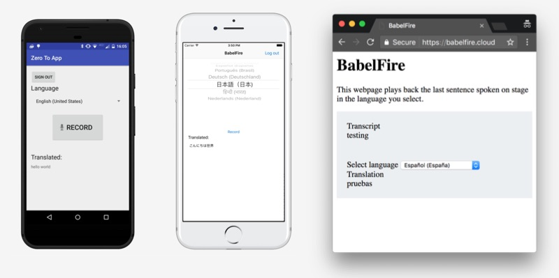

# Zero to App: Building a universal translator

Code from the Zero to App talk at [Cloud Next 2017](https://cloudnext.withgoogle.com/).

### Talk details

Firebase and Google Cloud Platform together help developers build extraordinary mobile and web apps. In this session, we'll craft an app live on stage and demonstrate how to create a great user experience using Firebase. We'll then extend this by calling into Cloud Platform APIs, without having to spin up servers or manage infrastructure. You'll experience firsthand how easy it is to build with Firebase, and how easy it is to scale with Google Cloud.

- [Slides](slides.pdf)
- [Video](https://www.youtube.com/watch?v=VHIoXPgOR90)

### Speakers

- [Frank van Puffelen](https://github.com/puf)
- [Jen Tong](https://github.com/mimming/)
- [Mike McDonald](https://github.com/mcdonamp)

## What's here

The talk had three live coding sessions. This repository has a directory for each one.

- `android` - Android app
- `ios` - iOS app
- `js` - JavaScript for Cloud Functions, and the JS / HTML translation viewer

## Contributing

Please read and follow the steps in the [CONTRIBUTING.md](CONTRIBUTING.md)

## License
See [LICENSE](LICENSE)
